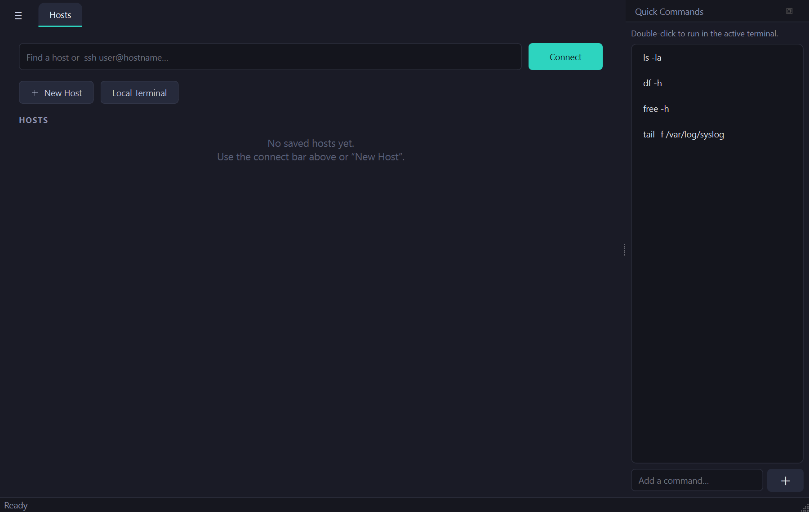
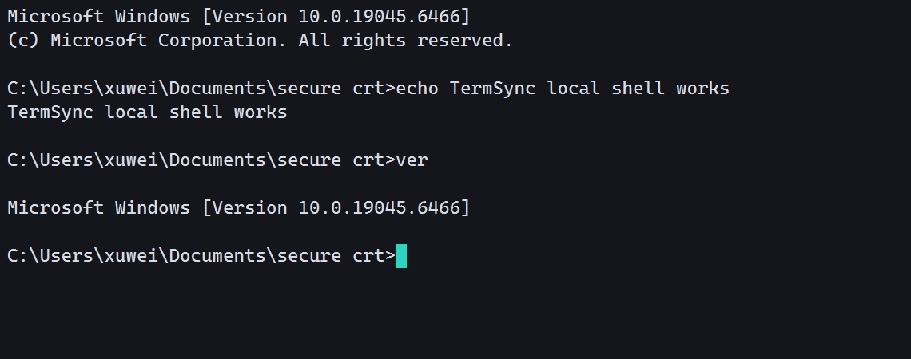
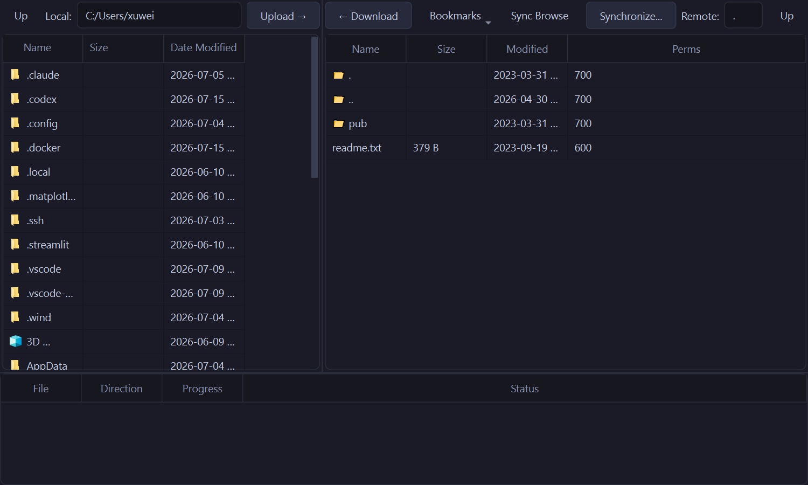
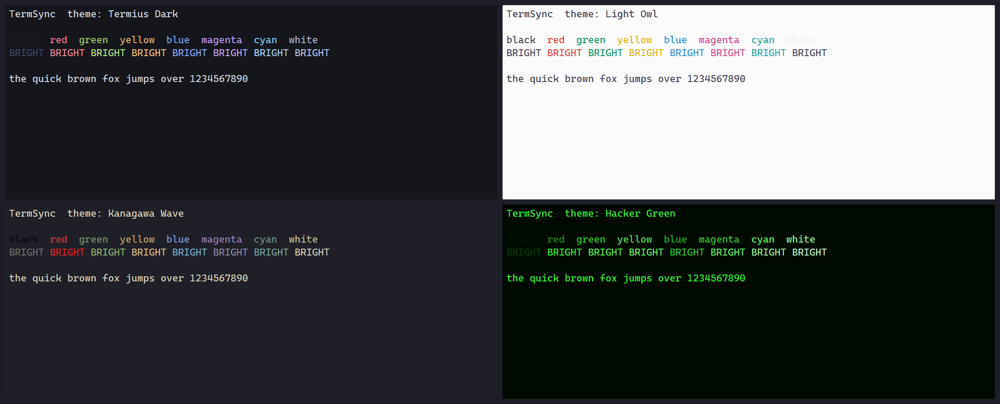

# TermSync

[](https://github.com/vv233/TermSync/actions/workflows/ci.yml)
[](https://github.com/vv233/TermSync/releases)
[](https://github.com/vv233/TermSync/releases)
[](LICENSE)


TermSync is an open-source, cross-platform remote operations client built with
C++17 and Qt 6. It combines tabbed terminal sessions, connection profiles,
file transfer, synchronization, automation, and a headless CLI in one project.

> **Pre-release:** `0.1.0-pre.3` is intended for validation. Configuration and
> behavior may still change before the first stable release. See
> [known limitations](docs/known-limitations.md) for current rough edges.



<sub>Terminal session (local shell):</sub>



<sub>Dual-pane SFTP transfer with a transfer queue and Synchronize:</sub>



<sub>Pick a skin — 14 built-in color schemes (Termius, Flexoki, Kanagawa, Everforest, Night Owl, and more):</sub>



## Download

Grab the latest build from the [**Releases**](https://github.com/vv233/TermSync/releases) page.

| Platform | File | Run it |
|---|---|---|
| **Windows 10/11 (x64)** | `TermSync-<ver>-Setup.exe` (installer) or `TermSync-<ver>-win64.zip` (portable) | Run the installer, or unzip and launch `termsync.exe` |
| **Linux (x86_64)** | `TermSync-<ver>-x86_64.AppImage` | `chmod +x TermSync-*.AppImage && ./TermSync-*.AppImage` |

> **Windows SmartScreen:** current builds are **not yet code-signed**, so
> Windows may show an "unrecognized app" prompt — choose **More info → Run
> anyway**. (Signing is planned; see [docs/code-signing.md](docs/code-signing.md).)
>
> **Linux:** the AppImage needs FUSE (`sudo apt install libfuse2` on newer
> Ubuntu), or run it with `--appimage-extract-and-run`.

## Platform support

| OS | Status |
|---|---|
| Windows 10/11 (x64) | ✅ Supported (installer + portable) |
| Linux (x86_64) | ✅ Supported (AppImage) |
| macOS | ⛔ Not yet — the Qt 6.8 build references the removed `AGL` framework; will return once a Qt/SDK combo without it is used |

## Current capabilities

- SSH2, Telnet, serial, local shell, TN3270, and first-pass TN5250 sessions
- VT/xterm terminal rendering, color schemes, logging, keyword highlighting,
  hex view, scripting, port forwarding, X11 forwarding, and proxy support
- SecureCRT-style terminal clipboard behavior: selecting text copies it
  immediately, right-click pastes, and Shift+right-click opens the context menu
- SFTP, FTP, FTPS, and SCP transfer through Explorer-style and dual-pane views
- Transfer queues, pause/resume, bandwidth limits, reconnect, synchronization,
  bookmarks, native Windows drag-out, tar-stream directory transfer, and sudo mode
- Saved profiles, OS credential storage, host-key trust, import/export, and host
  operating-system icons
- `termsync-cli` for transfer, synchronization, scheduling, remote execution,
  local execution, and remote file editing

See [feature-status.md](docs/feature-status.md) for verified coverage and known
gaps, and [architecture.md](docs/architecture.md) for the component layout.

## Quick start

1. Launch TermSync — the **Hosts** home page opens.
2. Type `user@host` (optionally `:port`) in the connect bar and press Enter, or
   use **File → Quick Connect** to pick a protocol and enter credentials.
3. Tick **Save session** to keep the host as a card on the home page; the
   password can be stored in your OS credential vault.
4. For file transfer, open a saved SSH/SFTP host's file view, then drag between
   the local and remote panes or use **Synchronize…** for a dry-run preview.

## Build and test

Prerequisites and platform setup are documented in [building.md](docs/building.md).

```bash
cmake --preset default
cmake --build --preset default
ctest --preset default
```

The current suite contains 130+ automated tests.

## Pre-release packaging

`release/` is the only distribution output. On the configured Windows build
machine, refresh the runnable bundle and its versioned ZIP with:

```powershell
powershell -File scripts/make-release.ps1
```

Do not distribute executables from `build/`; those are development intermediates.

The Windows installer offers VcXsrv as a default optional component. It is
installed from the verified WinGet package when selected. When X11 forwarding
is enabled, TermSync starts VcXsrv on demand with a generated Xauthority cookie;
it does not disable X11 access control with `-ac`.

## Technology

| Area | Library |
|---|---|
| UI | Qt 6 Widgets |
| SSH2/SFTP | libssh2 |
| FTP/FTPS | libcurl |
| Configuration | SQLite and nlohmann/json |
| Terminal | Project VT parser, screen buffer, and QPainter renderer |

## Contributing

Issues and pull requests are welcome. See [CONTRIBUTING.md](CONTRIBUTING.md) for
the build/test workflow and coding conventions, and
[SECURITY.md](SECURITY.md) to report a vulnerability privately.

## License

TermSync is licensed under MIT. Third-party components retain their own licenses;
see [THIRD_PARTY_NOTICES.md](THIRD_PARTY_NOTICES.md).

---

*Not affiliated with or endorsed by VanDyke Software. "SecureCRT" and "SecureFX"
are trademarks of VanDyke Software, Inc., referenced here only to describe
feature-compatibility goals.*
